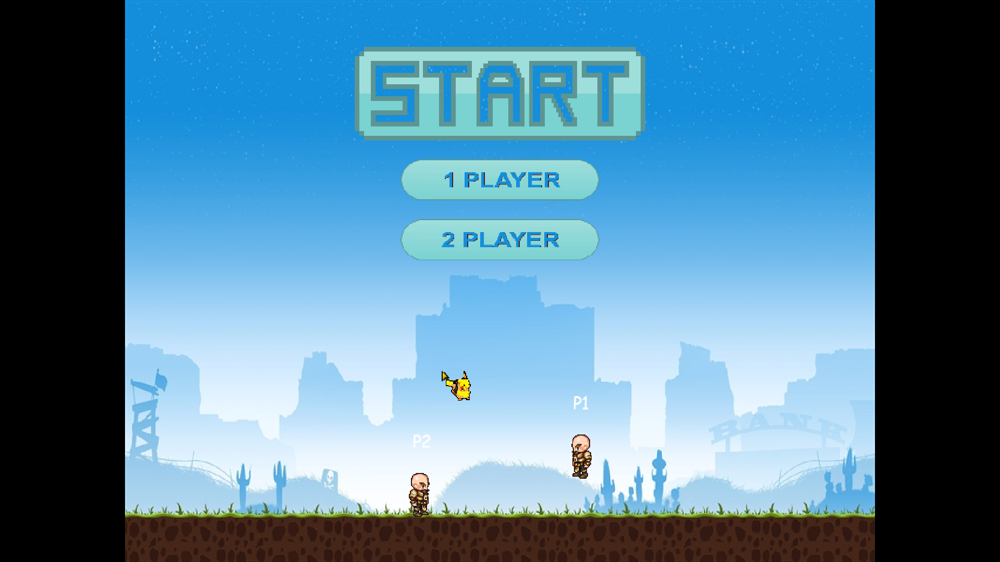
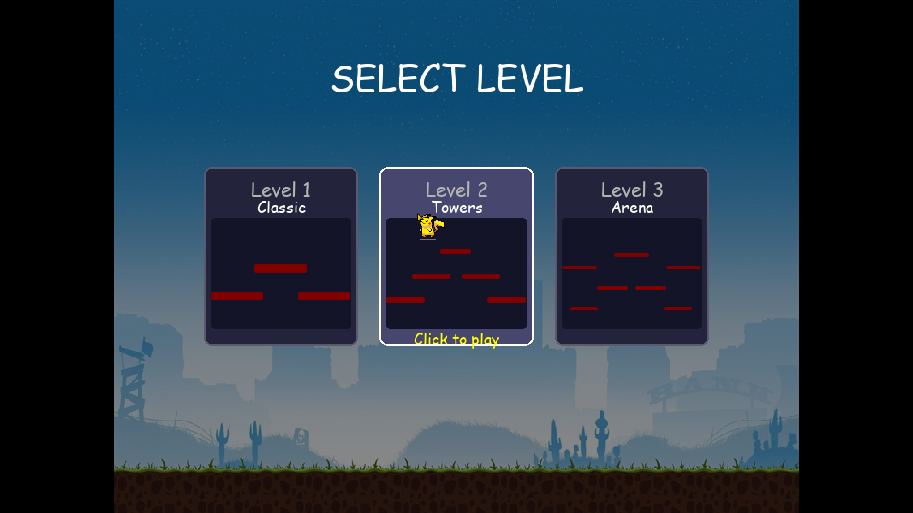
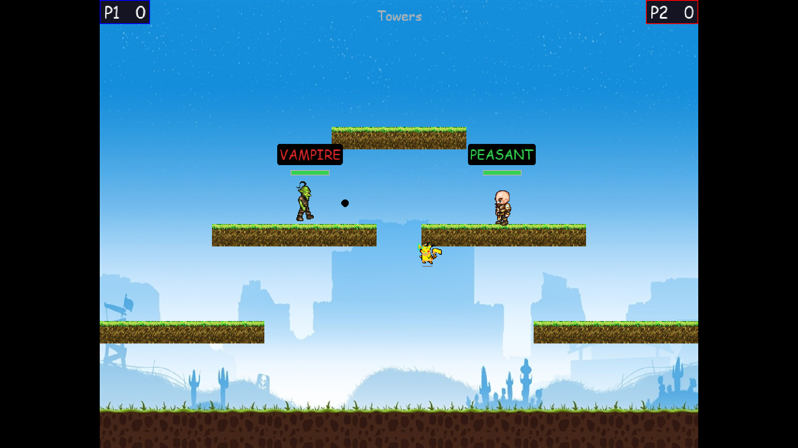

# The Hunted

My first-ever pygame project — kept here as a learning artifact. A local 1-or-2-player platformer where one player is the vampire and the other the peasant, with the roles randomised each round.

> **Note on assets:** the code and game logic are mine, but most assets (art, music, sound) are unlicensed placeholders I collected when I was starting out. My later projects use properly-licensed CC0 assets. Please don't reuse the assets here.


## Gameplay

- In every round, one player becomes the **vampire** and the other a **peasant**, chosen randomly.
- The vampire is **faster** and wins by catching/touching the peasant.
- Only the peasant can **fire bullets**.
- 1-player mode pits you against a built-in **AI opponent** with separate vampire / peasant behaviours.

### Screenshots

| Menu | Level select | Round in progress |
|------|--------------|-------------------|
|  |  |  |

### Controls

| Action | Player 1 | Player 2 |
|---|---|---|
| Move | Arrow keys | WASD |
| Jump | Up arrow | W |
| Fire | Right Ctrl | Space |

In 1-player mode you control **both keysets** and play against the AI.

## Download

[](https://umutcanekinci.itch.io/the-hunted)

Grab a ready-to-play build for your OS from [itch.io](https://umutcanekinci.itch.io/the-hunted) or the [latest GitHub release](https://github.com/umutcanekinci/hunted/releases/latest) — no Python required. Unzip and run:

| OS | Run |
|----|-----|
| Windows | Extract `hunted-windows.zip`, run `hunted.exe` |
| macOS | Extract `hunted-macos.zip`, open `Hunted.app` |
| Linux | Extract `hunted-linux.zip`, run `./hunted/hunted` |

> macOS Gatekeeper: the app is unsigned, so the first launch needs **right-click → Open** (or `xattr -dr com.apple.quarantine Hunted.app`).

## Requirements (from source)

- Python 3.12+
- [pygame-ce](https://github.com/pygame-community/pygame-ce) (resolved automatically from `pyproject.toml` / `uv.lock`)
- [uv](https://docs.astral.sh/uv/) (optional but recommended)

## Running

```bash
git clone --recurse-submodules https://github.com/umutcanekinci/hunted.git
cd hunted
uv sync
uv run python __main__.py
```

If you forgot `--recurse-submodules`: `git submodule update --init`.

Without `uv`: `pip install .` then `python __main__.py`.

## Building a standalone bundle

Builds are produced by [PyInstaller](https://pyinstaller.org/) from `hunted.spec`, which bundles `assets/` alongside the executable (onedir). To build locally for your current OS:

```bash
uv sync --group build
uv run pyinstaller hunted.spec --noconfirm
```

The result lands in `dist/hunted/` (`dist/Hunted.app` on macOS).

### Cutting a release

Per-OS bundles for Windows, macOS, and Linux are built and published automatically by [`.github/workflows/release.yml`](.github/workflows/release.yml) when a version tag is pushed:

```bash
git tag v0.1.0
git push origin v0.1.0
```

The workflow builds on each OS, zips the bundle, attaches all three to a GitHub Release (with auto-generated notes), and pushes each build to its [itch.io](https://umutcanekinci.itch.io/the-hunted) channel via [Butler](https://itch.io/docs/butler/). Use the workflow's **Run workflow** button to test a build without publishing.

## Project layout

```
__main__.py            Entry point — injects src/ + src/pygame_core/ into sys.path
src/game.py            Game class — state machine over menu / level-select / game
src/world.py           GameWorld dataclass (platforms, bullets, window dims)
src/entities.py        Player, Platform, Projectile
src/combat.py          Bullet physics + round transitions
src/input_handler.py   KeyboardInputHandler + AIInputHandler protocols
src/menu.py            Main-menu drawing + button states
src/renderer.py        Level-select + in-game drawing
src/audio.py           Menu / game music
src/cursor.py          Custom multi-state cursor
src/settings.py        Physics, combat, colors, and 3 level layouts
src/pygame_core/       Engine submodule (used only for Application + Mouse + GameObject)
assets/                Images and sounds
```

See [CLAUDE.md](CLAUDE.md) for the full architecture overview.

## Author

Umutcan Ekinci — [umutcannekinci@gmail.com](mailto:umutcannekinci@gmail.com)

See also the [contributors](https://github.com/umutcanekinci/hunted/contributors).

## License

The **code** in this repository is licensed under the MIT License — see the [LICENSE](LICENSE) file.

The **assets** (images, audio, fonts) are **not** covered by that license. They are placeholders gathered from various third-party sources during my first project, before I understood asset licensing, and are not licensed for reuse or redistribution. If you fork this repo, swap them for your own or for properly-licensed alternatives (e.g. [Kenney](https://kenney.nl), CC0).